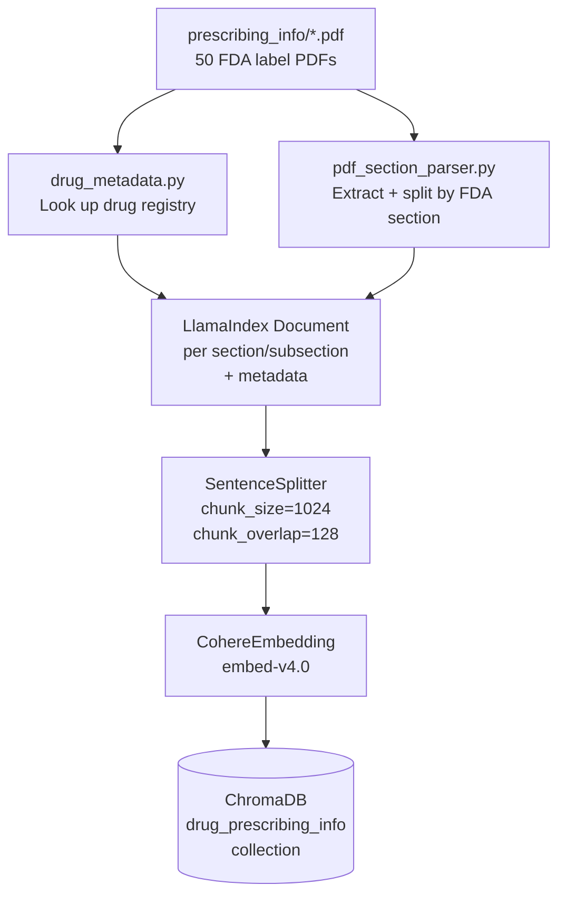
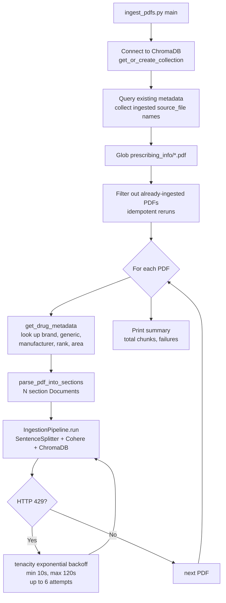
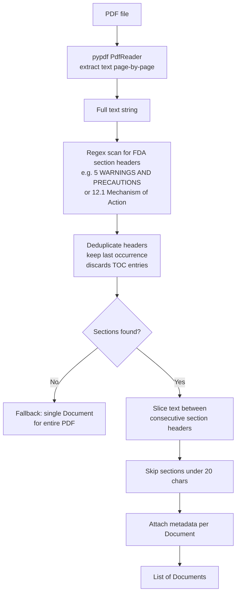
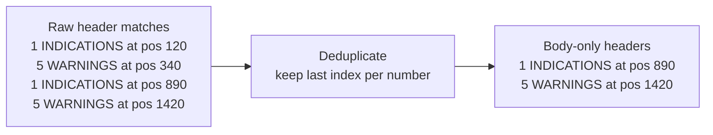
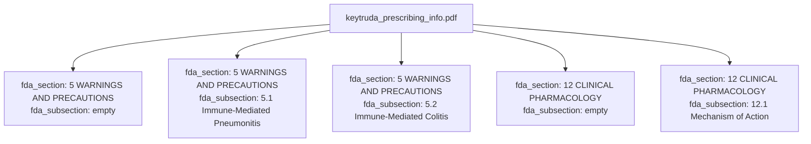
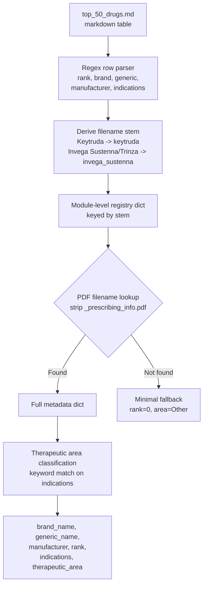
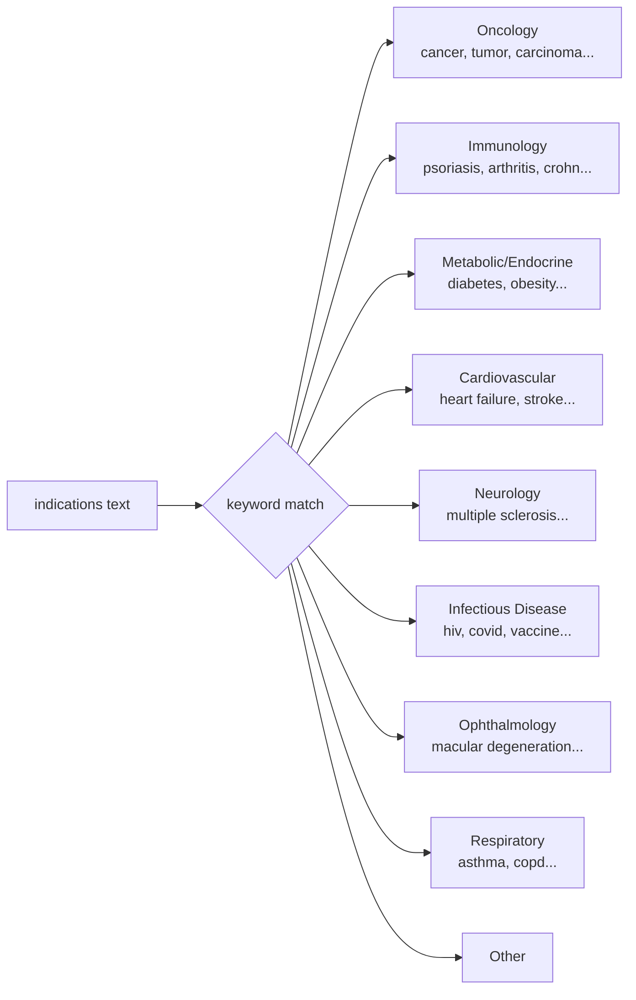
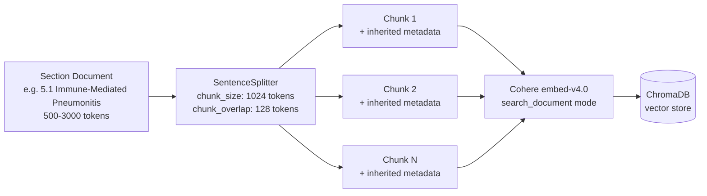
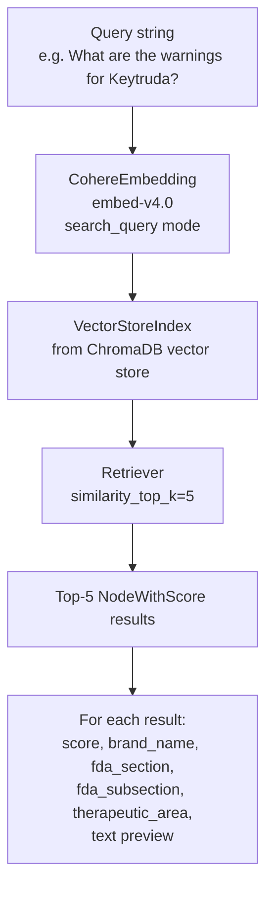

# parser-v1

PDF ingestion and embedding pipeline for FDA prescribing information. Parses the top-50 drug PDFs into section-aware chunks and stores them in a ChromaDB vector store for RAG retrieval.

## Overview



## Ingestion Pipeline (`ingest_pdfs.py`)

The entry point. For each PDF in `prescribing_info/`:



### Running

```bash
COHERE_API_KEY=<key> uv run python -m parser_v1.scripts.ingest_pdfs
```

Or with a `.env` file containing `COHERE_API_KEY`.

## Document Ingestion (`pdf_section_parser.py`)



### TOC Deduplication

FDA labels begin with a table of contents that lists every section header before the body content. Without deduplication, every section would appear twice. The parser keeps the **last** occurrence of each section number, which is always the actual body text.



### Section Detection

Headers are matched with this regex pattern:

```
^\d{1,2}(?:\.\d{1,2})?\s+[A-Z][A-Z &,/\-]{2,}.*$
```

This captures both top-level sections (`5 WARNINGS AND PRECAUTIONS`) and subsections (`5.1 Immune-Mediated Pneumonitis`).

### Document Hierarchy

Each PDF produces a two-level document tree. Subsection documents inherit the parent section label as `fda_section`.



Each `Document` carries:

| Metadata key | Example value | Included in embedding | Included in LLM context |
|---|---|---|---|
| `source_file` | `keytruda_prescribing_info.pdf` | No | Yes |
| `fda_section` | `5 WARNINGS AND PRECAUTIONS` | Yes | Yes |
| `fda_subsection` | `5.1 Immune-Mediated Pneumonitis` | Yes | Yes |
| `brand_name` | `Keytruda` | Yes | Yes |
| `generic_name` | `pembrolizumab` | Yes | Yes |
| `manufacturer` | `Merck` | Yes | Yes |
| `rank` | `1` | No | No |
| `indications` | `Melanoma, NSCLC, ...` | Yes | Yes |
| `therapeutic_area` | `Oncology` | Yes | Yes |

## Drug Metadata (`drug_metadata.py`)



### Therapeutic Area Classification



## Chunking Strategy



| Parameter | Value | Rationale |
|---|---|---|
| Chunk size | 1024 tokens | Fits dense clinical text with enough context per chunk |
| Chunk overlap | 128 tokens | Preserves sentence continuity at boundaries |
| Splitter | `SentenceSplitter` | Respects sentence boundaries; avoids mid-sentence cuts |
| Embedding model | `embed-v4.0` (Cohere) | High-quality retrieval embeddings; `search_document` input type |
| Vector store | ChromaDB (persistent) | Local, file-based; no external service required |

The two-level split strategy — **section first, then sentence-boundary chunks** — keeps the FDA section and subsection labels as metadata on every chunk. This enables hybrid retrieval filtering (e.g., "search only within section 5 WARNINGS" or "filter by therapeutic_area=Oncology") without re-parsing.

## Query / Retrieval (`query.py`)



Note the asymmetric embedding modes: documents are ingested with `search_document` and queries use `search_query`. Cohere's `embed-v4.0` is trained to maximize similarity between these two modes.

## Project Structure

```
packages/parser-v1/
├── src/parser_v1/
│   ├── config.py                  # COLLECTION_NAME constant
│   ├── scripts/
│   │   ├── ingest_pdfs.py         # Main pipeline entry point
│   │   ├── pdf_section_parser.py  # PDF -> section Documents
│   │   ├── drug_metadata.py       # Metadata registry from top_50_drugs.md
│   │   ├── query.py               # Query/retrieval helpers
│   │   └── download_*.py          # PDF download scripts (from DailyMed)
│   └── tests/
│       ├── test_ingest_pdfs.py
│       ├── test_section_parser.py
│       └── test_drug_metadata.py
└── pyproject.toml
```
