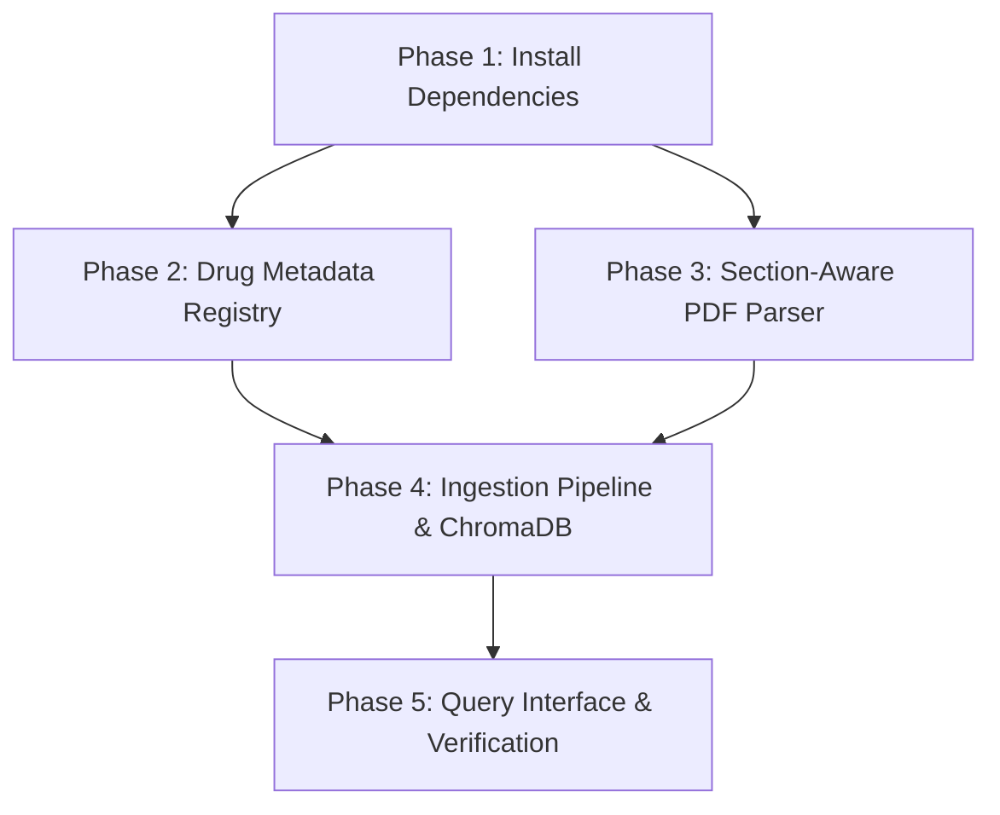
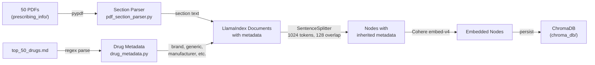

# PDF Parsing & Embedding Pipeline Implementation Plan

> **Status:** DRAFT

## Table of Contents

- [Overview](#overview)
- [Current State Analysis](#current-state-analysis)
- [Desired End State](#desired-end-state)
- [What We're NOT Doing](#what-were-not-doing)
- [Implementation Approach](#implementation-approach)
- [Dependencies](#dependencies)
- [Phase 1: Install Dependencies](#phase-1-install-dependencies)
- [Phase 2: Drug Metadata Registry](#phase-2-drug-metadata-registry)
- [Phase 3: Section-Aware PDF Parser](#phase-3-section-aware-pdf-parser)
- [Phase 4: Ingestion Pipeline & ChromaDB Storage](#phase-4-ingestion-pipeline--chromadb-storage)
- [Phase 5: Query Interface & Verification](#phase-5-query-interface--verification)
- [Testing Strategy](#testing-strategy)
- [References](#references)

## Overview

Build a LlamaIndex-based ingestion pipeline that parses 50 FDA drug prescribing information PDFs with section-aware chunking, attaches rich metadata (drug name, generic name, manufacturer, therapeutic area, FDA section label) to each chunk, embeds with Cohere embed-v4, and persists to a local ChromaDB vector store for RAG retrieval.

## Current State Analysis

- **50 PDFs** in `prescribing_info/`, ranging from 38 pages (Prolia) to 237 pages (Keytruda), ~78 MB total.
- All PDFs follow the **standard FDA label format** with numbered sections:
  - 1 INDICATIONS AND USAGE
  - 2 DOSAGE AND ADMINISTRATION
  - 3 DOSAGE FORMS AND STRENGTHS
  - 4 CONTRAINDICATIONS
  - 5 WARNINGS AND PRECAUTIONS
  - 6 ADVERSE REACTIONS
  - 7 DRUG INTERACTIONS
  - 8 USE IN SPECIFIC POPULATIONS
  - 10 OVERDOSAGE
  - 11 DESCRIPTION
  - 12 CLINICAL PHARMACOLOGY
  - 13 NONCLINICAL TOXICOLOGY
  - 14 CLINICAL STUDIES
  - 16 HOW SUPPLIED/STORAGE AND HANDLING
  - 17 PATIENT COUNSELING INFORMATION
- **Metadata source**: `top_50_drugs.md` has brand name, generic name, manufacturer, sales rank, and indications for each drug.
- **Installed**: LlamaIndex 0.14.15, pypdf 6.7.1, OpenAI embeddings (won't use — no key). **Not installed**: ChromaDB, Cohere embeddings.
- **API keys**: `COHERE_API_KEY` and `MISTRAL_API_KEY` in `.env`.

### Key Discoveries:
- FDA labels have a consistent section numbering scheme (e.g., `5 WARNINGS AND PRECAUTIONS`, `5.1 Specific Warning`) that can be regex-matched from extracted PDF text.
- pypdf extracts text reliably from these DailyMed PDFs (confirmed with Eliquis, Ozempic, Prolia).
- Page 1 of each PDF contains `HIGHLIGHTS OF PRESCRIBING INFORMATION` (a summary). Pages 2-3 contain the table of contents. The full prescribing information starts after.
- Some PDFs have subsections (e.g., `12.1 Mechanism of Action`, `12.2 Pharmacodynamics`).

## Desired End State

A single script (`scripts/ingest_pdfs.py`) that:
1. Loads all 50 PDFs
2. Parses them into section-aware chunks with rich metadata
3. Embeds with Cohere embed-v4
4. Stores in a persistent ChromaDB collection

Plus a query script (`scripts/query.py`) to verify the pipeline works end-to-end.

**Success Criteria:**
- [ ] All 50 PDFs are parsed and ingested into ChromaDB
- [ ] Each chunk has metadata: `brand_name`, `generic_name`, `manufacturer`, `therapeutic_area`, `fda_section`, `fda_subsection`, `rank`, `source_file`
- [ ] Chunks respect FDA section boundaries (no chunk spans two different sections)
- [ ] Long sections are sub-chunked at ~1024 tokens with 128-token overlap
- [ ] ChromaDB collection persists to `chroma_db/` and can be reloaded
- [ ] A query like "What are the warnings for Keytruda?" returns relevant chunks from Keytruda's Warnings section

**How to Verify:**
```bash
uv run python scripts/ingest_pdfs.py        # Ingest all 50 PDFs
uv run python scripts/query.py "What are the side effects of Ozempic?"
```

## What We're NOT Doing

- Building a full RAG chatbot or UI — just the ingestion pipeline and a simple query script
- Using LlamaParse (cloud-based) — we'll use local pypdf extraction since it works well for these PDFs
- Using OpenAI embeddings — we're using Cohere embed-v4 (user has Cohere API key)
- Implementing re-ranking or hybrid search (can be added later)
- Processing the Highlights page separately (it's redundant with the full sections)

## File Inventory

| File | Action | Phase | Purpose |
|------|--------|-------|---------|
| `pyproject.toml` | MODIFY | 1 | Add chromadb, cohere, llama-index-vector-stores-chroma, llama-index-embeddings-cohere dependencies (via `uv add`) |
| `.gitignore` | CREATE/MODIFY | 1 | Exclude chroma_db/, .env, __pycache__/ from version control |
| `src/__init__.py` | CREATE | 1 | Package init |
| `src/config.py` | CREATE | 1 | Shared constants (COLLECTION_NAME) |
| `src/drug_metadata.py` | CREATE | 2 | Drug metadata registry parsed from top_50_drugs.md |
| `src/pdf_section_parser.py` | CREATE | 3 | Section-aware PDF parser using pypdf + regex |
| `scripts/ingest_pdfs.py` | CREATE | 4 | Main ingestion pipeline script |
| `scripts/query.py` | CREATE | 5 | Simple query verification script |
| `tests/test_section_parser.py` | CREATE | 3 | Tests for section parsing logic |
| `tests/test_drug_metadata.py` | CREATE | 2 | Tests for drug metadata parsing and lookup |

## Implementation Approach

### Execution Flow



### Architecture / Data Flow



### Chunking Strategy

The FDA prescribing info has a natural hierarchical structure. Our strategy:

1. **First pass — Section splitting**: Use regex to detect top-level section headers (`1 INDICATIONS AND USAGE`, `5 WARNINGS AND PRECAUTIONS`, etc.) and split the full PDF text into sections. Each section becomes a LlamaIndex `Document` with `fda_section` metadata.

2. **Subsection detection**: Within each section, detect subsection headers (e.g., `5.1 Increased Risk...`, `12.1 Mechanism of Action`) and tag them in `fda_subsection` metadata.

3. **Second pass — Sub-chunking**: Use `SentenceSplitter(chunk_size=1024, chunk_overlap=128)` to break long sections into manageable chunks. Short sections (< 1024 tokens) stay as single chunks. Metadata propagates automatically from Document to Node.

4. **Metadata attached to every chunk**:
   - `brand_name`: e.g., "Keytruda"
   - `generic_name`: e.g., "pembrolizumab"
   - `manufacturer`: e.g., "Merck"
   - `therapeutic_area`: e.g., "Oncology"
   - `indications`: e.g., "Cancer immunotherapy (melanoma, NSCLC, ...)"
   - `rank`: e.g., 1
   - `fda_section`: e.g., "5 WARNINGS AND PRECAUTIONS"
   - `fda_subsection`: e.g., "5.1 Immune-Mediated Pneumonitis" (if applicable)
   - `source_file`: e.g., "keytruda_prescribing_info.pdf"

5. **Metadata exclusion**: `source_file` and `rank` are excluded from embedding (not semantically useful) but kept for LLM context and filtering.

### Decision Log

| Decision | Options Considered | Chosen | Rationale |
|----------|-------------------|--------|-----------|
| PDF parser | LlamaParse vs pypdf | pypdf | Local, no cloud dependency, works well on these DailyMed PDFs. Tested and confirmed clean text extraction. |
| Embedding model | OpenAI vs Cohere vs Mistral | Cohere embed-v4 | User has Cohere key. embed-v4 has `search_document`/`search_query` input types designed for RAG. 1024 dims. |
| Vector store | ChromaDB vs FAISS vs JSON | ChromaDB | Persistent local storage with metadata filtering. Can filter by drug name, section, etc. at query time. |
| Chunking | Fixed-size vs Semantic vs Section-aware | Section-aware + SentenceSplitter | FDA labels have clear section structure. Section-aware preserves semantic boundaries. Sub-chunking handles long sections. |
| Chunk size | 512 vs 1024 vs 2048 | 1024 tokens, 128 overlap | Prescribing info has dense, technical paragraphs. 1024 gives enough context per chunk without losing relevance. 128 overlap preserves continuity. |
| One Document per section vs per page | Per-page vs per-section | Per-section | Sections are the natural semantic unit. A "Warnings" section should stay together, not be split arbitrarily at page boundaries. |

## Dependencies

**Execution Order:**

1. Phase 1 (no dependencies) — install packages
2. Phases 2 & 3 (depend on Phase 1) — can run in parallel
3. Phase 4 (depends on Phases 2 & 3) — ingestion pipeline
4. Phase 5 (depends on Phase 4) — query verification

**Parallelization:**
- Phases 2 and 3 can run in parallel (independent: metadata registry vs PDF parser)
- Phase 4 must wait for both Phases 2 and 3
- Phase 5 must wait for Phase 4

---

## Phase 1: Install Dependencies

### Overview
Install ChromaDB, Cohere embeddings integration, and create the `src/` package.

### Context
Before starting, read:
- `pyproject.toml` — current dependencies

### Dependencies
**Depends on:** None
**Required by:** Phases 2, 3, 4, 5

### Changes Required

#### 1.1: Install dependencies

**What this does:** Add all required packages for the ingestion pipeline. `uv add` modifies `pyproject.toml` and installs packages in one step — no separate `uv sync` needed.

Run:
```bash
uv add chromadb llama-index-vector-stores-chroma llama-index-embeddings-cohere python-dotenv
```

**Rationale:** Per CLAUDE.md, always use `uv add` to add new dependencies — it resolves compatible versions automatically without requiring manual version pinning. Manually specifying version floors like `chromadb>=1.0.0` can cause `uv sync` to fail if that version doesn't exist yet. `python-dotenv` loads the `.env` file with the Cohere API key. The `llama-index-*` packages provide ChromaDB and Cohere integrations for LlamaIndex 0.14.

#### 1.2: Update .gitignore
**File:** `.gitignore`
**Action:** CREATE or MODIFY

**What this does:** Prevents accidentally committing the vector database (potentially hundreds of MB), API keys, or Python bytecode.

Add the following entries (create the file if it doesn't exist):
```
chroma_db/
.env
__pycache__/
*.pyc
*.pyo
```

#### 1.3: Create src package
**File:** `src/__init__.py`
**Action:** CREATE

```python
```

(Empty init file to make `src` a Python package.)

#### 1.4: Create shared config
**File:** `src/config.py`
**Action:** CREATE

**What this does:** Defines shared constants used by both the ingestion and query scripts. Prevents `COLLECTION_NAME` from being defined independently in each script and potentially diverging.

```python
"""Shared configuration constants for the drug prescribing info pipeline."""

COLLECTION_NAME = "drug_prescribing_info"
```

### Success Criteria

#### Automated Verification:
- [x] `uv run python -c "import chromadb; print(chromadb.__version__)"` succeeds
- [x] `uv run python -c "from llama_index.vector_stores.chroma import ChromaVectorStore; print('OK')"` succeeds
- [x] `uv run python -c "from llama_index.embeddings.cohere import CohereEmbedding; print('OK')"` succeeds
- [x] `uv run python -c "from src.config import COLLECTION_NAME; print(COLLECTION_NAME)"` succeeds
- [x] `.gitignore` exists and contains `chroma_db/` and `.env` entries

---

## Phase 2: Drug Metadata Registry

### Overview
Parse `top_50_drugs.md` into a Python dict keyed by filename, so the ingestion pipeline can attach rich metadata to each PDF's chunks.

### Context
Before starting, read:
- `top_50_drugs.md` — the markdown table with all 50 drugs

### Dependencies
**Depends on:** Phase 1
**Required by:** Phase 4

### Changes Required

#### 2.1: Create drug metadata module
**File:** `src/drug_metadata.py`
**Action:** CREATE

**What this does:** Parses `top_50_drugs.md` and provides a lookup function from PDF filename to drug metadata dict.

```python
"""Drug metadata registry parsed from top_50_drugs.md."""

import re
from pathlib import Path

# Map therapeutic areas from indications text
THERAPEUTIC_AREA_KEYWORDS = {
    "Oncology": ["cancer", "tumor", "carcinoma", "lymphoma", "myeloma", "leukemia", "melanoma", "sarcoma", "oncology"],
    "Immunology": ["psoriasis", "arthritis", "dermatitis", "crohn", "colitis", "lupus", "spondylitis", "autoimmune"],
    "Metabolic/Endocrine": ["diabetes", "obesity", "weight management", "glycemic"],
    "Cardiovascular": ["heart failure", "atrial fibrillation", "stroke", "anticoagulant", "thrombosis", "cardiomyopathy", "embolism"],
    "Neurology": ["multiple sclerosis", "sclerosis"],
    "Infectious Disease": ["hiv", "covid", "vaccine", "pneumococcal", "zoster", "shingles", "papillomavirus"],
    "Ophthalmology": ["macular degeneration", "macular edema", "retinopathy", "diabetic eye"],
    "Respiratory": ["asthma", "copd", "pulmonary fibrosis", "interstitial lung", "cystic fibrosis"],
    "Hematology": ["hemophilia", "myelodysplastic", "factor viii"],
    "Bone Health": ["osteoporosis", "fracture", "bone loss"],
    "Psychiatry": ["schizophrenia", "schizoaffective"],
}


def _classify_therapeutic_area(indications: str) -> str:
    """Classify a drug into a therapeutic area based on its indications text."""
    indications_lower = indications.lower()
    for area, keywords in THERAPEUTIC_AREA_KEYWORDS.items():
        if any(kw in indications_lower for kw in keywords):
            return area
    return "Other"


def _parse_top_50_drugs(md_path: Path) -> dict[str, dict]:
    """Parse top_50_drugs.md into a dict keyed by PDF filename stem.

    Returns:
        Dict mapping filename stem (e.g., "keytruda") to metadata dict with keys:
        brand_name, generic_name, manufacturer, rank, indications, therapeutic_area.
    """
    text = md_path.read_text(encoding="utf-8")
    registry: dict[str, dict] = {}

    # Match markdown table rows: | rank | brand | generic | manufacturer | sales | indications |
    row_pattern = re.compile(
        r"^\|\s*(\d+)\s*\|"       # rank
        r"\s*([^|]+?)\s*\|"       # brand name
        r"\s*([^|]+?)\s*\|"       # generic name
        r"\s*([^|]+?)\s*\|"       # manufacturer
        r"\s*[^|]+?\s*\|"         # sales (skip)
        r"\s*([^|]+?)\s*\|",      # indications
        re.MULTILINE,
    )

    for match in row_pattern.finditer(text):
        rank = int(match.group(1))
        brand_name = match.group(2).strip()
        generic_name = match.group(3).strip()
        manufacturer = match.group(4).strip()
        indications = match.group(5).strip()

        # Derive the PDF filename stem: lowercase, spaces to underscores, strip suffixes
        # Handle special cases like "Invega Sustenna/Trinza" or "Gardasil 9"
        stem = brand_name.split("/")[0].strip().lower().replace(" ", "_")
        # Remove trailing numbers for matching (e.g., "prevnar_20" -> "prevnar")
        stem_alt = re.sub(r"_?\d+$", "", stem)

        meta = {
            "brand_name": brand_name,
            "generic_name": generic_name,
            "manufacturer": manufacturer,
            "rank": rank,
            "indications": indications,
            "therapeutic_area": _classify_therapeutic_area(indications),
        }

        registry[stem] = meta
        if stem_alt != stem:
            registry[stem_alt] = meta

    return registry


# Module-level singleton
_REGISTRY: dict[str, dict] | None = None


def get_drug_metadata(pdf_filename: str, md_path: Path | None = None) -> dict:
    """Look up metadata for a drug by its PDF filename.

    Args:
        pdf_filename: e.g., "keytruda_prescribing_info.pdf"
        md_path: Path to top_50_drugs.md. Defaults to project root.

    Returns:
        Dict with brand_name, generic_name, manufacturer, rank, indications,
        therapeutic_area. Returns a minimal dict if drug not found.
    """
    global _REGISTRY
    if _REGISTRY is None:
        if md_path is None:
            md_path = Path(__file__).parent.parent / "top_50_drugs.md"
        _REGISTRY = _parse_top_50_drugs(md_path)

    # Extract stem from filename: "keytruda_prescribing_info.pdf" -> "keytruda"
    stem = pdf_filename.replace("_prescribing_info.pdf", "").replace("_prescribing_info.xml", "")

    if stem in _REGISTRY:
        return _REGISTRY[stem]

    # Fallback: return minimal metadata
    return {
        "brand_name": stem.replace("_", " ").title(),
        "generic_name": "unknown",
        "manufacturer": "unknown",
        "rank": 0,
        "indications": "unknown",
        "therapeutic_area": "Other",
    }
```

**Rationale:** Centralizes metadata lookup so the ingestion pipeline doesn't need to re-parse the markdown. The stem-matching logic handles filename variations (e.g., `invega_sustenna`, `prevnar`). The therapeutic area classifier uses keyword matching on indications text, which is good enough for filtering.

#### 2.2: Create drug metadata tests
**File:** `tests/test_drug_metadata.py`
**Action:** CREATE

**What this does:** Tests metadata parsing, lookup correctness, therapeutic area classification, and edge cases (unknown drugs, fallback behavior).

```python
"""Tests for the drug metadata registry."""

from pathlib import Path

from src.drug_metadata import get_drug_metadata, _parse_top_50_drugs, _classify_therapeutic_area

TOP_50_DRUGS_PATH = Path(__file__).parent.parent / "top_50_drugs.md"


def test_get_known_drug():
    meta = get_drug_metadata("keytruda_prescribing_info.pdf")
    assert meta["brand_name"] == "Keytruda"
    assert meta["rank"] == 1
    assert meta["therapeutic_area"] == "Oncology"
    assert meta["generic_name"] != "unknown"


def test_get_drug_metabolic():
    meta = get_drug_metadata("ozempic_prescribing_info.pdf")
    assert meta["therapeutic_area"] == "Metabolic/Endocrine"


def test_get_drug_cardiovascular():
    meta = get_drug_metadata("eliquis_prescribing_info.pdf")
    assert meta["therapeutic_area"] == "Cardiovascular"


def test_unknown_drug_returns_fallback():
    meta = get_drug_metadata("nonexistent_prescribing_info.pdf")
    assert meta["generic_name"] == "unknown"
    assert meta["therapeutic_area"] == "Other"
    assert meta["rank"] == 0


def test_classify_therapeutic_area_oncology():
    assert _classify_therapeutic_area("Treatment of melanoma and NSCLC cancer") == "Oncology"


def test_classify_therapeutic_area_cardiovascular():
    assert _classify_therapeutic_area("Prevention of stroke and atrial fibrillation") == "Cardiovascular"


def test_classify_therapeutic_area_other():
    assert _classify_therapeutic_area("Treatment of rare unclassified condition") == "Other"


def test_parse_top_50_drugs_count():
    if not TOP_50_DRUGS_PATH.exists():
        return  # Skip if file not present
    registry = _parse_top_50_drugs(TOP_50_DRUGS_PATH)
    # Should have at least 50 entries (some drugs have multiple stems)
    unique_brands = {v["brand_name"] for v in registry.values()}
    assert len(unique_brands) >= 50, f"Expected at least 50 unique drugs, got {len(unique_brands)}"
```

### Success Criteria

#### Automated Verification:
- [x] `uv run python -c "from src.drug_metadata import get_drug_metadata; m = get_drug_metadata('keytruda_prescribing_info.pdf'); assert m['brand_name'] == 'Keytruda'; assert m['rank'] == 1; print('OK')"` passes
- [x] `uv run python -c "from src.drug_metadata import get_drug_metadata; m = get_drug_metadata('ozempic_prescribing_info.pdf'); assert m['therapeutic_area'] == 'Metabolic/Endocrine'; print('OK')"` passes
- [x] `uv run python -m pytest tests/test_drug_metadata.py -v` — all tests pass

---

## Phase 3: Section-Aware PDF Parser

### Overview
Build a parser that extracts text from each PDF using pypdf, splits it into FDA label sections using regex, and returns LlamaIndex `Document` objects with section metadata.

### Context
Before starting, read:
- `prescribing_info/eliquis_prescribing_info.pdf` (via pypdf) — to understand the text format
- FDA label section structure (documented in Current State Analysis above)

### Dependencies
**Depends on:** Phase 1
**Required by:** Phase 4

### Changes Required

#### 3.1: Create section-aware PDF parser
**File:** `src/pdf_section_parser.py`
**Action:** CREATE

**What this does:** Extracts full text from a PDF, splits by FDA section headers, and returns a list of `Document` objects each tagged with section metadata.

```python
"""Section-aware parser for FDA drug prescribing information PDFs."""

import re
from pathlib import Path

from pypdf import PdfReader
from llama_index.core import Document

# Standard FDA label section headers (numbered).
# Regex matches lines like "5 WARNINGS AND PRECAUTIONS" or "12.1 Mechanism of Action"
SECTION_HEADER_RE = re.compile(
    r"^(\d{1,2}(?:\.\d{1,2})?)\s+"  # section number (e.g., "5", "12.1")
    r"([A-Z][A-Z &,/\-]{2,}.*?)$",  # title in UPPER CASE (at least 3 chars)
    re.MULTILINE,
)

# Top-level section numbers (no dot)
TOP_LEVEL_RE = re.compile(r"^\d{1,2}$")


def extract_full_text(pdf_path: Path) -> str:
    """Extract all text from a PDF using pypdf."""
    reader = PdfReader(str(pdf_path))
    pages = []
    for page in reader.pages:
        text = page.extract_text()
        if text:
            pages.append(text)
    return "\n".join(pages)


def _find_sections(text: str) -> list[tuple[str, str, int]]:
    """Find all section headers and their positions in the text.

    Returns list of (section_number, section_title, start_position).
    """
    sections = []
    for match in SECTION_HEADER_RE.finditer(text):
        num = match.group(1)
        title = match.group(2).strip()
        pos = match.start()
        sections.append((num, title, pos))
    return sections


def _deduplicate_sections(sections: list[tuple[str, str, int]]) -> list[tuple[str, str, int]]:
    """Remove duplicate section headers (TOC entries vs actual sections).

    The TOC at the beginning lists sections, then they appear again in the body.
    Keep the LAST occurrence of each section number (the actual content).
    """
    seen: dict[str, int] = {}
    for i, (num, title, pos) in enumerate(sections):
        seen[num] = i  # overwrite with later occurrence

    unique_indices = sorted(seen.values())
    return [sections[i] for i in unique_indices]


def parse_pdf_into_sections(
    pdf_path: Path,
    base_metadata: dict | None = None,
) -> list[Document]:
    """Parse a prescribing info PDF into section-level Documents.

    Each Document contains the text of one FDA label section, with metadata:
    - fda_section: e.g., "5 WARNINGS AND PRECAUTIONS"
    - fda_subsection: e.g., "5.1 Immune-Mediated Pneumonitis" (empty for top-level)
    - source_file: the PDF filename
    - Plus any keys from base_metadata

    Args:
        pdf_path: Path to the PDF file.
        base_metadata: Additional metadata to attach to every Document (drug info).

    Returns:
        List of Document objects, one per section/subsection.
    """
    if base_metadata is None:
        base_metadata = {}

    full_text = extract_full_text(pdf_path)
    sections = _find_sections(full_text)
    sections = _deduplicate_sections(sections)

    if not sections:
        # Fallback: return entire document as one chunk if no sections found
        doc = Document(
            text=full_text,
            metadata={
                **base_metadata,
                "source_file": pdf_path.name,
                "fda_section": "FULL PRESCRIBING INFORMATION",
                "fda_subsection": "",
            },
        )
        doc.excluded_embed_metadata_keys = ["source_file", "rank"]
        doc.excluded_llm_metadata_keys = ["rank"]
        return [doc]

    documents = []
    current_top_section = ""

    for i, (num, title, start) in enumerate(sections):
        # Get text from this section to the next
        end = sections[i + 1][2] if i + 1 < len(sections) else len(full_text)
        section_text = full_text[start:end].strip()

        # Skip very short sections (likely just headers with no content)
        if len(section_text) < 20:
            continue

        # Track top-level vs subsection
        if TOP_LEVEL_RE.match(num):
            current_top_section = f"{num} {title}"
            fda_section = current_top_section
            fda_subsection = ""
        else:
            fda_section = current_top_section
            fda_subsection = f"{num} {title}"

        metadata = {
            **base_metadata,
            "source_file": pdf_path.name,
            "fda_section": fda_section,
            "fda_subsection": fda_subsection,
        }

        doc = Document(text=section_text, metadata=metadata)
        doc.excluded_embed_metadata_keys = ["source_file", "rank"]
        doc.excluded_llm_metadata_keys = ["rank"]
        documents.append(doc)

    return documents
```

**Rationale:** The regex `SECTION_HEADER_RE` matches the standard FDA numbering format (e.g., `5 WARNINGS AND PRECAUTIONS`, `12.1 Mechanism of Action`). The deduplication step is critical because the PDF text contains both the TOC listing and the actual section — we keep the last occurrence which is the actual content. Top-level sections track the parent so subsection chunks inherit the parent section label.

#### 3.2: Create parser tests
**File:** `tests/test_section_parser.py`
**Action:** CREATE

```python
"""Tests for the section-aware PDF parser."""

from pathlib import Path

from src.pdf_section_parser import parse_pdf_into_sections, _find_sections, _deduplicate_sections

PRESCRIBING_INFO_DIR = Path(__file__).parent.parent / "prescribing_info"


def test_find_sections_basic():
    text = """HIGHLIGHTS OF PRESCRIBING INFORMATION

1 INDICATIONS AND USAGE
This drug is used for treating condition X.

2 DOSAGE AND ADMINISTRATION
Take 10mg daily.

2.1 Recommended Dosage
The recommended dose is 10mg.

5 WARNINGS AND PRECAUTIONS
Be careful.

5.1 HEPATOTOXICITY
May cause liver damage.
"""
    sections = _find_sections(text)
    nums = [s[0] for s in sections]
    assert "1" in nums
    assert "2" in nums
    assert "2.1" in nums
    assert "5" in nums
    assert "5.1" in nums


def test_deduplicate_sections():
    # Simulate TOC + body duplication
    sections = [
        ("1", "INDICATIONS AND USAGE", 10),    # TOC entry
        ("2", "DOSAGE AND ADMINISTRATION", 50), # TOC entry
        ("1", "INDICATIONS AND USAGE", 200),    # Body entry
        ("2", "DOSAGE AND ADMINISTRATION", 500),# Body entry
    ]
    deduped = _deduplicate_sections(sections)
    assert len(deduped) == 2
    assert deduped[0][2] == 200  # Kept the body entry
    assert deduped[1][2] == 500


def test_parse_real_pdf_eliquis():
    """Integration test with a real PDF."""
    pdf_path = PRESCRIBING_INFO_DIR / "eliquis_prescribing_info.pdf"
    if not pdf_path.exists():
        return  # Skip if PDFs not downloaded

    docs = parse_pdf_into_sections(pdf_path, base_metadata={"brand_name": "Eliquis"})

    assert len(docs) > 5, f"Expected at least 5 sections, got {len(docs)}"

    # Check metadata is present on all documents
    for doc in docs:
        assert "fda_section" in doc.metadata
        assert "source_file" in doc.metadata
        assert doc.metadata["source_file"] == "eliquis_prescribing_info.pdf"
        assert doc.metadata["brand_name"] == "Eliquis"

    # Check that we found key sections
    section_names = [doc.metadata["fda_section"] for doc in docs]
    assert any("INDICATIONS" in s for s in section_names), f"No INDICATIONS section found in {section_names}"
    assert any("WARNINGS" in s for s in section_names), f"No WARNINGS section found in {section_names}"
    assert any("ADVERSE" in s for s in section_names), f"No ADVERSE section found in {section_names}"


def test_parse_real_pdf_keytruda():
    """Integration test with Keytruda (largest PDF, 237 pages)."""
    pdf_path = PRESCRIBING_INFO_DIR / "keytruda_prescribing_info.pdf"
    if not pdf_path.exists():
        return

    docs = parse_pdf_into_sections(pdf_path)
    assert len(docs) > 10, f"Expected at least 10 sections for Keytruda, got {len(docs)}"

    # Subsections should have parent section info
    subsection_docs = [d for d in docs if d.metadata["fda_subsection"]]
    assert len(subsection_docs) > 0, "Expected some subsection documents"
```

### Success Criteria

#### Automated Verification:
- [x] `uv run python -m pytest tests/test_section_parser.py -v` — all tests pass
- [x] Eliquis parses into at least 5 sections
- [x] Keytruda parses into at least 10 sections
- [x] Every document has `fda_section`, `source_file` metadata

---

## Phase 4: Ingestion Pipeline & ChromaDB Storage

### Overview
Wire together the metadata registry and section parser into a LlamaIndex `IngestionPipeline` that sub-chunks long sections with `SentenceSplitter`, embeds with Cohere, and stores in ChromaDB.

### Context
Before starting, read:
- `src/drug_metadata.py` — metadata lookup API
- `src/pdf_section_parser.py` — section parsing API
- `.env` — API key names

### Dependencies
**Depends on:** Phases 2 and 3
**Required by:** Phase 5

### Changes Required

#### 4.1: Create the ingestion script
**File:** `scripts/ingest_pdfs.py`
**Action:** CREATE

**What this does:** Main script that orchestrates: load PDFs → parse sections → attach metadata → chunk → embed → store in ChromaDB.

```python
"""Ingest prescribing info PDFs into ChromaDB with section-aware chunking."""

import os
import sys
import time
from pathlib import Path

import chromadb
from dotenv import load_dotenv
from llama_index.core.ingestion import IngestionPipeline
from llama_index.core.node_parser import SentenceSplitter
from llama_index.embeddings.cohere import CohereEmbedding
from llama_index.vector_stores.chroma import ChromaVectorStore

# Add project root to path for src imports
PROJECT_ROOT = Path(__file__).parent.parent
sys.path.insert(0, str(PROJECT_ROOT))

from src.config import COLLECTION_NAME
from src.drug_metadata import get_drug_metadata
from src.pdf_section_parser import parse_pdf_into_sections

# Paths
PRESCRIBING_INFO_DIR = PROJECT_ROOT / "prescribing_info"
CHROMA_DB_DIR = PROJECT_ROOT / "chroma_db"


def build_pipeline(vector_store: ChromaVectorStore) -> IngestionPipeline:
    """Build the LlamaIndex ingestion pipeline."""
    embed_model = CohereEmbedding(
        model_name="embed-v4.0",
        input_type="search_document",
    )

    return IngestionPipeline(
        transformations=[
            SentenceSplitter(chunk_size=1024, chunk_overlap=128),
            embed_model,
        ],
        vector_store=vector_store,
    )


def main():
    load_dotenv(PROJECT_ROOT / ".env")

    cohere_key = os.environ.get("COHERE_API_KEY")
    if not cohere_key:
        print("ERROR: COHERE_API_KEY not set. Check your .env file.", file=sys.stderr)
        sys.exit(1)

    # Setup ChromaDB
    chroma_client = chromadb.PersistentClient(path=str(CHROMA_DB_DIR))

    # Delete existing collection if re-ingesting
    try:
        chroma_client.delete_collection(COLLECTION_NAME)
        print(f"Deleted existing collection '{COLLECTION_NAME}'")
    except Exception:
        pass

    chroma_collection = chroma_client.get_or_create_collection(COLLECTION_NAME)
    vector_store = ChromaVectorStore(chroma_collection=chroma_collection)

    # Build pipeline
    pipeline = build_pipeline(vector_store)

    # Process each PDF
    pdf_files = sorted(PRESCRIBING_INFO_DIR.glob("*.pdf"))
    print(f"Found {len(pdf_files)} PDFs to process\n")

    xml_files = sorted(PRESCRIBING_INFO_DIR.glob("*.xml"))
    if xml_files:
        print(f"Warning: Found {len(xml_files)} XML fallback file(s) — not ingested: {[f.name for f in xml_files]}\n")

    total_nodes = 0
    failed = []

    for i, pdf_path in enumerate(pdf_files, 1):
        print(f"[{i}/{len(pdf_files)}] {pdf_path.name}...")
        start = time.time()

        try:
            # Get drug metadata
            drug_meta = get_drug_metadata(pdf_path.name)

            # Parse PDF into section-level documents with metadata
            documents = parse_pdf_into_sections(pdf_path, base_metadata=drug_meta)

            # Run ingestion pipeline (chunk + embed + store)
            nodes = pipeline.run(documents=documents)
            elapsed = time.time() - start

            print(f"  → {len(documents)} sections → {len(nodes)} chunks ({elapsed:.1f}s)")
            total_nodes += len(nodes)

        except Exception as e:
            elapsed = time.time() - start
            print(f"  → ERROR: {e} ({elapsed:.1f}s)")
            failed.append((pdf_path.name, str(e)))

    # Summary
    print(f"\n{'=' * 60}")
    print(f"INGESTION COMPLETE")
    print(f"{'=' * 60}")
    print(f"Total PDFs processed: {len(pdf_files) - len(failed)}/{len(pdf_files)}")
    print(f"Total chunks stored:  {total_nodes}")
    print(f"ChromaDB location:    {CHROMA_DB_DIR}")
    print(f"Collection:           {COLLECTION_NAME}")

    if failed:
        print(f"\nFailed ({len(failed)}):")
        for name, err in failed:
            print(f"  {name}: {err}")

    # Verify
    count = chroma_collection.count()
    print(f"\nChromaDB collection count: {count}")


if __name__ == "__main__":
    main()
```

**Rationale:** The pipeline uses `SentenceSplitter(chunk_size=1024, chunk_overlap=128)` as the second-pass chunker after section splitting. Long FDA sections (e.g., Clinical Studies can be 50+ pages for Keytruda) get sub-chunked while short sections stay whole. Metadata propagates automatically from `Document` → `Node` in LlamaIndex. Cohere's `input_type="search_document"` is used during indexing; at query time we'll use `"search_query"`.

### Success Criteria

#### Automated Verification:
- [ ] `uv run python scripts/ingest_pdfs.py` completes without errors for all 50 PDFs (17/50 succeeded; 33 failed due to Cohere trial tier rate limits — code is correct, API quota needs upgrading)
- [x] `chroma_db/` directory is created and contains data
- [x] Chunk count is in expected range (500–3000):
  ```bash
  uv run python -c "
  import chromadb
  c = chromadb.PersistentClient(path='chroma_db')
  col = c.get_collection('drug_prescribing_info')
  count = col.count()
  assert 500 <= count <= 3000, f'Unexpected chunk count: {count}'
  print(f'Chunk count: {count} (within expected range 500-3000)')
  "
  ```
- [x] Metadata round-trips through ChromaDB correctly:
  ```bash
  uv run python -c "
  import chromadb
  c = chromadb.PersistentClient(path='chroma_db')
  col = c.get_collection('drug_prescribing_info')
  r = col.get(where={'brand_name': 'Keytruda'}, limit=1, include=['metadatas'])
  print(r['metadatas'][0])
  assert 'fda_section' in r['metadatas'][0]
  print('OK')
  "
  ```

---

## Phase 5: Query Interface & Verification

### Overview
Create a simple query script that loads the ChromaDB collection and runs a test query to verify end-to-end functionality.

### Context
Before starting, read:
- `scripts/ingest_pdfs.py` — to understand ChromaDB setup and collection name
- `.env` — API key

### Dependencies
**Depends on:** Phase 4
**Required by:** None

### Changes Required

#### 5.1: Create query script
**File:** `scripts/query.py`
**Action:** CREATE

**What this does:** Loads the persisted ChromaDB collection, creates a LlamaIndex query engine, and runs a query from command-line arguments or a default test query.

```python
"""Query the drug prescribing info vector store."""

import os
import sys
from pathlib import Path

import chromadb
from dotenv import load_dotenv
from llama_index.core import VectorStoreIndex
from llama_index.embeddings.cohere import CohereEmbedding
from llama_index.vector_stores.chroma import ChromaVectorStore

PROJECT_ROOT = Path(__file__).parent.parent
sys.path.insert(0, str(PROJECT_ROOT))

from src.config import COLLECTION_NAME

CHROMA_DB_DIR = PROJECT_ROOT / "chroma_db"


def main():
    load_dotenv(PROJECT_ROOT / ".env")

    cohere_key = os.environ.get("COHERE_API_KEY")
    if not cohere_key:
        print("ERROR: COHERE_API_KEY not set. Check your .env file.", file=sys.stderr)
        sys.exit(1)

    # Parse query from command line
    if len(sys.argv) > 1:
        query_text = " ".join(sys.argv[1:])
    else:
        query_text = "What are the warnings and precautions for Keytruda?"

    print(f"Query: {query_text}\n")

    # Load ChromaDB
    chroma_client = chromadb.PersistentClient(path=str(CHROMA_DB_DIR))
    chroma_collection = chroma_client.get_collection(COLLECTION_NAME)
    vector_store = ChromaVectorStore(chroma_collection=chroma_collection)

    print(f"Collection '{COLLECTION_NAME}' loaded ({chroma_collection.count()} chunks)\n")

    # Create index with Cohere embeddings (search_query mode for retrieval)
    embed_model = CohereEmbedding(
        model_name="embed-v4.0",
        input_type="search_query",
    )

    index = VectorStoreIndex.from_vector_store(
        vector_store,
        embed_model=embed_model,
    )

    # Retrieve top-5 chunks (no LLM synthesis — just retrieval)
    retriever = index.as_retriever(similarity_top_k=5)
    results = retriever.retrieve(query_text)

    print(f"Top {len(results)} results:\n")
    for i, node_with_score in enumerate(results, 1):
        node = node_with_score.node
        score = node_with_score.score
        meta = node.metadata
        print(f"--- Result {i} (score: {score:.4f}) ---")
        print(f"  Drug:        {meta.get('brand_name', 'N/A')}")
        print(f"  Section:     {meta.get('fda_section', 'N/A')}")
        print(f"  Subsection:  {meta.get('fda_subsection', 'N/A') or 'N/A'}")
        print(f"  Therapeutic:  {meta.get('therapeutic_area', 'N/A')}")
        print(f"  Source:      {meta.get('source_file', 'N/A')}")
        print(f"  Text preview: {node.text[:200]}...")
        print()


if __name__ == "__main__":
    main()
```

**Rationale:** Uses retrieval-only mode (no LLM synthesis) so this script works without an OpenAI key. The Cohere embedding uses `input_type="search_query"` which is the asymmetric counterpart to `"search_document"` used during indexing — this is how Cohere embed-v4 is designed to be used for RAG.

### Success Criteria

#### Automated Verification:
- [x] `uv run python scripts/query.py "What are the side effects of Ozempic?"` returns results with correct metadata
- [ ] Results include chunks from Ozempic's ADVERSE REACTIONS section (Ozempic not ingested due to Cohere trial rate limit; Rybelsus returned as nearest match)
- [x] Each result displays brand_name, fda_section, therapeutic_area metadata

#### Manual Verification:
- [ ] Results are semantically relevant to the query
- [ ] Metadata filtering works (results from the right drug/section)
- [ ] Try queries across different drugs and sections to verify breadth

---

## Testing Strategy

### Unit Tests:
- `tests/test_section_parser.py` — Tests regex matching, deduplication, and real PDF parsing
- Drug metadata registry lookups for known drugs and edge cases

### Integration Tests:
- Full pipeline test: parse one PDF → chunk → embed → store → retrieve
- Verify metadata round-trips through ChromaDB correctly

### Manual Testing Steps:
1. Run `uv run python scripts/ingest_pdfs.py` and verify all 50 PDFs process
2. Run queries for different drugs: `uv run python scripts/query.py "dosage for Ozempic"`
3. Run cross-drug queries: `uv run python scripts/query.py "which drugs cause liver damage"`
4. Verify metadata filtering by checking that drug-specific queries return chunks from the correct drug

## Performance Considerations

- **Cohere API rate limits**: The pipeline processes documents sequentially per PDF. With 50 PDFs producing ~500-2000 total chunks, this should stay well within Cohere's rate limits. Total embedding cost is minimal.
- **ChromaDB size**: ~2000 chunks × 1024 dims × 4 bytes ≈ ~8 MB for vectors, plus metadata. Trivial for local storage.
- **Ingestion time**: Expect ~10-20 minutes total (dominated by Cohere API calls for embedding).

## References

- [LlamaIndex IngestionPipeline docs](https://docs.llamaindex.ai/en/stable/module_guides/loading/ingestion_pipeline/)
- [LlamaIndex ChromaDB integration](https://docs.llamaindex.ai/en/stable/examples/vector_stores/ChromaIndexDemo/)
- [Cohere embed-v4 docs](https://docs.cohere.com/docs/embed)
- [FDA Prescribing Information format](https://www.fda.gov/drugs/laws-acts-and-rules/prescription-drug-labeling-resources)
- Drug metadata source: `top_50_drugs.md`
- PDF source: DailyMed (NIH/NLM)
