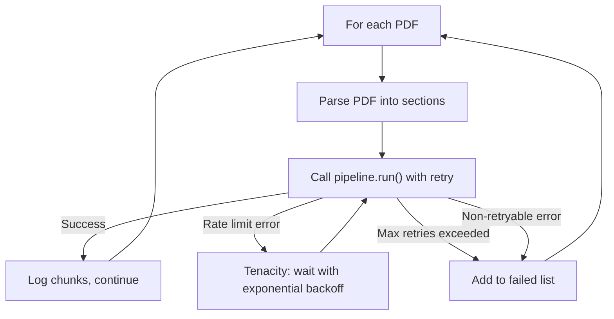

# Cohere Rate-Limit Retry with Tenacity Implementation Plan

> **Status:** DRAFT

## Table of Contents

- [Overview](#overview)
- [Current State Analysis](#current-state-analysis)
- [Desired End State](#desired-end-state)
- [What We're NOT Doing](#what-were-not-doing)
- [File Inventory](#file-inventory)
- [Implementation Approach](#implementation-approach)
- [Dependencies](#dependencies)
- [Phase 1: Add Tenacity Retry to Ingestion Pipeline](#phase-1-add-tenacity-retry-to-ingestion-pipeline)
- [Testing Strategy](#testing-strategy)
- [References](#references)

## Overview

33 of 50 PDFs failed during ChromaDB ingestion because the Cohere trial API enforces a 100K tokens/min rate limit. The `pipeline.run()` call in `ingest_pdfs.py` has no retry logic — when the API returns a rate-limit error, the exception is caught and the PDF is skipped.

This plan adds exponential backoff retry using the `tenacity` library (already a dependency) so that rate-limited requests are automatically retried after waiting, allowing all 50 PDFs to be ingested in a single run.

## Current State Analysis

- **File:** `packages/parser-v1/src/parser_v1/scripts/ingest_pdfs.py`
- **Line 91:** `nodes = pipeline.run(documents=documents)` — this is the Cohere API call site
- **Lines 99-102:** Exception handler catches ALL errors and adds to `failed` list with no retry
- **`tenacity>=9.1.4`** is already listed in `packages/parser-v1/pyproject.toml` line 16

### Key Discoveries:
- The ingestion loop (`ingest_pdfs.py:79-102`) processes PDFs sequentially with no delay between them
- Rate-limit errors from Cohere surface as exceptions from the LlamaIndex `IngestionPipeline.run()` method
- The `pipeline` object is reusable across calls — wrapping individual `pipeline.run()` calls in retry is safe

## Desired End State

When `ingest_pdfs.py` hits a Cohere rate limit, it automatically waits with exponential backoff (starting at 10s, max 120s) and retries up to 6 times before giving up on that PDF. Progress is logged so the user can see retry activity.

**Success Criteria:**
- [ ] `ingest_pdfs.py` retries on rate-limit errors with exponential backoff
- [ ] Retry attempts are logged to stdout with wait time and attempt number
- [ ] After max retries, the PDF is still added to the `failed` list (existing behavior preserved)
- [ ] Non-rate-limit errors (e.g., corrupt PDF) are NOT retried
- [ ] Existing tests still pass: `uv run pytest` from `packages/parser-v1/`

**How to Verify:**
- Run `uv run pytest` from `packages/parser-v1/` — all existing tests pass
- Run `uv run ruff check packages/parser-v1/` — no lint errors
- Run the full ingestion: `uv run python -m parser_v1.scripts.ingest_pdfs` and observe retry logs when rate-limited

## What We're NOT Doing

- Not upgrading the Cohere API plan or changing the embedding model
- Not adding retry to `query.py` (query-time embedding calls are single requests, unlikely to hit rate limits)
- Not adding a global rate limiter / token bucket — exponential backoff on failure is sufficient
- Not changing the ingestion pipeline architecture or adding batching
- Not adding new dependencies (tenacity is already installed)

## File Inventory

| File | Action | Phase | Purpose |
|------|--------|-------|---------|
| `packages/parser-v1/src/parser_v1/scripts/ingest_pdfs.py` | MODIFY | 1 | Add tenacity retry wrapper around `pipeline.run()` |

## Implementation Approach

### Execution Flow



### Decision Log

| Decision | Options Considered | Chosen | Rationale |
|----------|-------------------|--------|-----------|
| Retry scope | Retry entire PDF vs retry individual API calls | Retry entire `pipeline.run()` per PDF | `pipeline.run()` is the single call site; LlamaIndex handles batching internally |
| Which errors to retry | All errors vs rate-limit only | Rate-limit only (HTTP 429 / "rate limit" in message) | Retrying corrupt PDFs or auth errors wastes time |
| Initial wait | 5s, 10s, 30s | 10s | Cohere trial limit is per-minute; 10s gives meaningful cooldown without being too aggressive |
| Max wait | 60s, 120s, 300s | 120s | 2 min max is long enough for per-minute limits to reset |
| Max attempts | 3, 5, 6 | 6 | With 10s base and multiplier=2, 6 attempts covers up to ~5 min total wait which should handle bursty rate limits |
| Logging | stdlib logging vs loguru | loguru | loguru is already a dependency; tenacity's `before_sleep_log` only works with stdlib logging, so a custom `before_sleep` callback is used instead |

## Dependencies

**Execution Order:**
1. Phase 1 (single phase, no dependencies)

## Phase 1: Add Tenacity Retry to Ingestion Pipeline

### Overview
Wrap the `pipeline.run()` call with a tenacity-decorated helper function that retries on rate-limit errors using exponential backoff.

### Context
Before starting, read these files:
- `packages/parser-v1/src/parser_v1/scripts/ingest_pdfs.py` — the file being modified

### Dependencies
**Depends on:** None
**Required by:** Nothing

### Changes Required

#### 1.1: Add tenacity import and retry-wrapped helper function
**File:** `packages/parser-v1/src/parser_v1/scripts/ingest_pdfs.py`
**Action:** MODIFY

**What this does:** Adds `tenacity` and `loguru` imports, defines a custom retry predicate that only retries rate-limit errors, and creates a retry-decorated wrapper function for `pipeline.run()`.

**Before** (lines 1-6):
```python
"""Ingest prescribing info PDFs into ChromaDB with section-aware chunking."""

import os
import sys
import time
from pathlib import Path
```

**After:**
```python
"""Ingest prescribing info PDFs into ChromaDB with section-aware chunking."""

import os
import sys
import time
from pathlib import Path

from loguru import logger
from tenacity import (
    retry,
    retry_if_exception,
    retry_state,
    stop_after_attempt,
    wait_exponential,
)
```

#### 1.2: Add rate-limit detection predicate and retry-wrapped function
**File:** `packages/parser-v1/src/parser_v1/scripts/ingest_pdfs.py`
**Action:** MODIFY

**What this does:** Adds a predicate function that identifies rate-limit errors by checking for HTTP 429 status codes or "rate limit" in the error message, a loguru-based `before_sleep` callback, and a retry-decorated wrapper around `pipeline.run()`.

Note: tenacity's built-in `before_sleep_log` only works with stdlib `logging`. Since we use loguru, we define a custom `_log_retry` callback instead that calls `logger.warning()` directly with the retry state details.

**Before** (lines 24-38, the `build_pipeline` function and its surrounding whitespace):
```python
def build_pipeline(vector_store: ChromaVectorStore, api_key: str) -> IngestionPipeline:
    """Build the LlamaIndex ingestion pipeline."""
    embed_model = CohereEmbedding(
        api_key=api_key,
        model_name="embed-v4.0",
        input_type="search_document",
    )

    return IngestionPipeline(
        transformations=[
            SentenceSplitter(chunk_size=1024, chunk_overlap=128),
            embed_model,
        ],
        vector_store=vector_store,
    )
```

**After:**
```python
def _is_rate_limit_error(exc: BaseException) -> bool:
    """Return True if the exception looks like an API rate-limit error."""
    msg = str(exc).lower()
    if "429" in msg or "rate limit" in msg or "rate_limit" in msg or "too many requests" in msg:
        return True
    # Check for nested/chained exceptions
    if exc.__cause__:
        return _is_rate_limit_error(exc.__cause__)
    return False


def _log_retry(rs: retry_state) -> None:
    """Log retry attempts via loguru before sleeping."""
    wait = rs.next_action.sleep if rs.next_action else 0
    logger.warning(
        "Rate limit hit — retrying in {wait:.1f}s (attempt {attempt}/6)",
        wait=wait,
        attempt=rs.attempt_number,
    )


def build_pipeline(vector_store: ChromaVectorStore, api_key: str) -> IngestionPipeline:
    """Build the LlamaIndex ingestion pipeline."""
    embed_model = CohereEmbedding(
        api_key=api_key,
        model_name="embed-v4.0",
        input_type="search_document",
    )

    return IngestionPipeline(
        transformations=[
            SentenceSplitter(chunk_size=1024, chunk_overlap=128),
            embed_model,
        ],
        vector_store=vector_store,
    )


@retry(
    retry=retry_if_exception(_is_rate_limit_error),
    wait=wait_exponential(multiplier=1, min=10, max=120),
    stop=stop_after_attempt(6),
    before_sleep=_log_retry,
    reraise=True,
)
def _run_pipeline_with_retry(pipeline: IngestionPipeline, documents: list) -> list:
    """Run the ingestion pipeline with retry on rate-limit errors."""
    return pipeline.run(documents=documents)
```

#### 1.3: Replace `pipeline.run()` call with retry wrapper
**File:** `packages/parser-v1/src/parser_v1/scripts/ingest_pdfs.py`
**Action:** MODIFY

**What this does:** Swaps the bare `pipeline.run()` call for the retry-wrapped version.

**Before** (line 91):
```python
            nodes = pipeline.run(documents=documents)
```

**After:**
```python
            nodes = _run_pipeline_with_retry(pipeline, documents)
```

### Success Criteria

#### Automated Verification:
- [ ] Existing tests pass: run `uv run pytest` from `packages/parser-v1/`
- [ ] Linting passes: run `uv run ruff check packages/parser-v1/src/`
- [ ] File is valid Python: run `uv run python -c "import parser_v1.scripts.ingest_pdfs"`

#### Manual Verification:
- [ ] Run full ingestion (`uv run python -m parser_v1.scripts.ingest_pdfs`) and confirm retry logs appear when rate-limited
- [ ] Confirm all 50 PDFs eventually ingest successfully (or fail for non-rate-limit reasons only)

## Testing Strategy

### Unit Tests:
- The `_is_rate_limit_error` predicate could be unit tested, but since this is a small utility and the real validation is the manual ingestion run, no new unit tests are required for this change.

### Manual Testing Steps:
1. From the project root, run `uv run python -m parser_v1.scripts.ingest_pdfs`
2. Observe that when a rate-limit error occurs, the script prints a retry warning with the wait time instead of immediately failing
3. Confirm all 50 PDFs are ingested (or the only failures are non-rate-limit errors like corrupt XML files)

## References

- Ingestion script: `packages/parser-v1/src/parser_v1/scripts/ingest_pdfs.py`
- Tenacity docs: https://tenacity.readthedocs.io/
- Cohere rate limits: https://docs.cohere.com/docs/rate-limits
- README note about 33 failed PDFs: `README.md:75`
