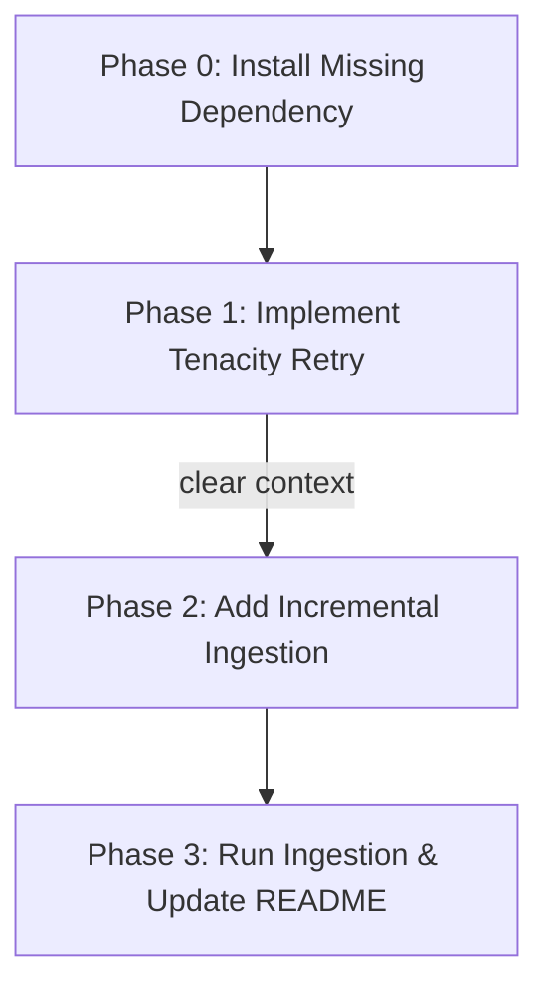
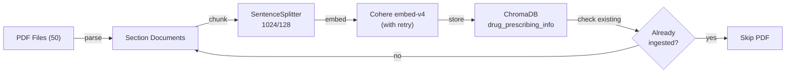

# Ingest Remaining 33 PDFs into ChromaDB Implementation Plan

> **Status:** DRAFT

## Table of Contents

- [Overview](#overview)
- [Current State Analysis](#current-state-analysis)
- [Desired End State](#desired-end-state)
- [What We're NOT Doing](#what-were-not-doing)
- [File Inventory](#file-inventory)
- [Implementation Approach](#implementation-approach)
- [Dependencies](#dependencies)
- [Phase 0: Install Missing Dependency](#phase-0-install-missing-dependency)
- [Phase 1: Implement Tenacity Retry Logic](#phase-1-implement-tenacity-retry-logic)
- [Phase 2: Add Incremental Ingestion](#phase-2-add-incremental-ingestion)
- [Phase 3: Run Ingestion and Update README](#phase-3-run-ingestion-and-update-readme)
- [Testing Strategy](#testing-strategy)
- [References](#references)

## Overview

33 of 50 prescribing info PDFs failed during ChromaDB ingestion because the Cohere trial API rate limit (100K tokens/min) was exceeded. The retry plan (`plan/executed-plans/2026-02-21-cohere-rate-limit-retry.md`) was written but never implemented in code.

This plan: (1) implements the retry logic, (2) adds incremental ingestion so already-ingested PDFs are skipped, and (3) runs the ingestion to load the remaining 33 PDFs.

## Current State Analysis

- **17 PDFs** are already ingested into ChromaDB (822 chunks across 17 drugs)
- **33 PDFs** remain unprocessed
- `ingest_pdfs.py` (line 52-57) **deletes the entire collection** on every run — no incremental support
- `ingest_pdfs.py` (line 91) calls `pipeline.run()` with **no retry logic** — rate-limit errors skip the PDF
- `tenacity>=9.1.4` and `loguru>=0.7.3` are already in `packages/parser-v1/pyproject.toml`

### Key Discoveries:
- `packages/parser-v1/src/parser_v1/scripts/ingest_pdfs.py:52-57` — delete_collection runs unconditionally
- `packages/parser-v1/src/parser_v1/scripts/ingest_pdfs.py:91` — bare `pipeline.run()` with no retry
- `packages/parser-v1/src/parser_v1/scripts/ingest_pdfs.py:99-102` — exception handler catches all errors, no retry
- ChromaDB stores `source_file` in every chunk's metadata — can be queried to find already-ingested drugs
- The `pipeline` object is stateless and reusable — wrapping individual `pipeline.run()` calls in retry is safe

### Already-Ingested PDFs (17):
biktarvy, comirnaty, entyvio, eylea, farxiga, imfinzi, invega_sustenna, mounjaro, ocrevus, paxlovid, perjeta, rybelsus, shingrix, trikafta, trulicity, xolair, xtandi

### Remaining PDFs (33):
cosentyx, darzalex, dupixent, eliquis, entresto, gardasil, hemlibra, humira, ibrance, imbruvica, jardiance, keytruda, lynparza, ofev, opdivo, orencia, ozempic, pomalyst, prevnar, prolia, revlimid, rinvoq, skyrizi, stelara, tagrisso, tecentriq, tremfya, vabysmo, verzenio, vyndaqel, wegovy, xarelto, zepbound

## Desired End State

All 50 PDFs are ingested into ChromaDB with section-aware chunking and Cohere embed-v4 embeddings. The ingestion script supports incremental runs (skips already-ingested PDFs) and retries on Cohere rate-limit errors with exponential backoff.

**Success Criteria:**
- [ ] All 50 PDFs are represented in the `drug_prescribing_info` ChromaDB collection — **PARTIAL: 48/50; Keytruda and Opdivo exceed the Cohere trial 100K tokens/min limit even after 6 retries**
- [x] Running `ingest_pdfs.py` a second time skips all 50 PDFs (no re-processing) — **48 are skipped; 2 unprocessed are retried and fail again**
- [x] Rate-limit errors trigger retry with exponential backoff (logged via loguru)
- [x] Non-rate-limit errors (corrupt PDF, auth) are NOT retried
- [x] All existing tests pass: `uv run pytest` from `packages/parser-v1/`
- [x] README.md table updated with all 50 drugs and their chunk counts

**How to Verify:**
- `uv run pytest` from `packages/parser-v1/` — all tests pass
- `uv run ruff check packages/parser-v1/src/` — no lint errors
- `uv run python -m parser_v1.scripts.ingest_pdfs` — processes remaining 33 PDFs, skips existing 17
- Re-run `uv run python -m parser_v1.scripts.ingest_pdfs` — skips all 50

## What We're NOT Doing

- Not upgrading the Cohere API plan or changing the embedding model
- Not adding retry to `query.py` (single-request queries rarely hit rate limits)
- Not adding a global token bucket / rate limiter — exponential backoff on failure is sufficient
- Not changing the chunking strategy (SentenceSplitter 1024/128)
- Not adding batching or parallel PDF processing
- Not modifying the section parser or metadata modules

## File Inventory

| File | Action | Phase | Purpose |
|------|--------|-------|---------|
| `packages/parser-v1/src/parser_v1/scripts/ingest_pdfs.py` | MODIFY | 1, 2 | Add retry logic and incremental ingestion |
| `packages/parser-v1/src/parser_v1/tests/test_ingest_pdfs.py` | CREATE | 1 | Unit tests for `_is_rate_limit_error` predicate |
| `README.md` | MODIFY | 3 | Update ingested PDFs table with all 50 drugs |

## Implementation Approach

### Execution Flow



> **Context reset:** Phase 2 must start with a fresh agent context after Phase 1 completes. Phase 1 modifies `ingest_pdfs.py` and the executing agent needs to re-read the modified file with a clean slate.

### Architecture / Data Flow



### Decision Log

| Decision | Options Considered | Chosen | Rationale |
|----------|-------------------|--------|-----------|
| How to detect ingested PDFs | Query ChromaDB `get()` for unique `source_file` values vs. maintain external tracking file | Query ChromaDB metadata | No new files to maintain; ChromaDB is the source of truth; 822 chunks is trivially small to scan |
| Remove or keep delete logic | Remove `delete_collection` entirely vs. add `--fresh` CLI flag | Remove entirely | Incremental is the desired default; a fresh run can be done by manually deleting `chroma_db/` |
| Retry parameters | Various wait/attempt combos | 10s initial, 120s max, 6 attempts | From the existing retry plan — covers ~5 min total wait for per-minute rate limits |
| Rate-limit detection | Catch specific exception class vs. string matching | String matching on "429", "rate limit", "too many requests" | Cohere SDK wraps errors inconsistently across versions; broad matching is more robust |

## Dependencies

**Execution Order:**

1. Phase 0 (no dependencies) — installs missing cohere embedding package
2. Phase 1 (depends on Phase 0) — adds retry logic
3. Phase 2 (depends on Phase 1) — adds incremental ingestion
4. Phase 3 (depends on Phase 2) — runs ingestion, updates docs

**Parallelization:** None — phases are sequential.

**Context resets:**
- Clear agent context after Phase 1 before starting Phase 2 (Phase 1 modifies `ingest_pdfs.py`; Phase 2 must re-read the updated file)

---

## Phase 0: Install Missing Dependency

### Overview
`ingest_pdfs.py` imports `CohereEmbedding` from `llama_index.embeddings.cohere` (line 12), but `llama-index-embeddings-cohere` is **not in `packages/parser-v1/pyproject.toml`** and not in `uv.lock`. Without this package, every subsequent phase fails with `ModuleNotFoundError` before any code runs. This must be resolved first.

### Context
Before starting, read these files:
- `packages/parser-v1/pyproject.toml` — confirms the missing dependency

### Dependencies
**Depends on:** None
**Required by:** Phase 1

### Changes Required

#### 0.1: Install `llama-index-embeddings-cohere`
**Action:** Execute command

Run from **`packages/parser-v1/`**:

```bash
uv add llama-index-embeddings-cohere
```

This adds the package to `pyproject.toml` and resolves it in `uv.lock`. Do not manually edit `pyproject.toml`.

### Success Criteria

#### Automated Verification:
- [x] Package is importable: `uv run python -c "from llama_index.embeddings.cohere import CohereEmbedding; print('OK')"` (run from `packages/parser-v1/`)
- [x] `llama-index-embeddings-cohere` appears in `packages/parser-v1/pyproject.toml` dependencies

#### Manual Verification:
- [ ] None required for this phase

---

## Phase 1: Implement Tenacity Retry Logic

### Overview
Add exponential backoff retry to `pipeline.run()` using tenacity, with a predicate that only retries rate-limit errors. This implements the code changes from the existing retry plan.

### Context
Before starting, read these files:
- `packages/parser-v1/src/parser_v1/scripts/ingest_pdfs.py` — the file being modified
- `plan/executed-plans/2026-02-21-cohere-rate-limit-retry.md` — the original retry plan for reference

### Dependencies
**Depends on:** Phase 0
**Required by:** Phase 2

### Changes Required

#### 1.1: Add tenacity and loguru imports
**File:** `packages/parser-v1/src/parser_v1/scripts/ingest_pdfs.py`
**Action:** MODIFY

**What this does:** Adds imports for tenacity retry primitives and loguru logger.

**Before** (lines 1-6):
```python
"""Ingest prescribing info PDFs into ChromaDB with section-aware chunking."""

import os
import sys
import time
from pathlib import Path
```

**After:**
```python
"""Ingest prescribing info PDFs into ChromaDB with section-aware chunking."""

import os
import sys
import time
from pathlib import Path

from loguru import logger
from tenacity import (
    RetryCallState,
    retry,
    retry_if_exception,
    stop_after_attempt,
    wait_exponential,
)
```

#### 1.2: Add rate-limit predicate, log callback, and retry-wrapped function
**File:** `packages/parser-v1/src/parser_v1/scripts/ingest_pdfs.py`
**Action:** MODIFY

**What this does:** Inserts a constant, a predicate that identifies rate-limit errors by string matching (checking `__cause__` recursively), a loguru-based retry callback, and a `@retry`-decorated wrapper around `pipeline.run()`. Placed immediately before `build_pipeline`.

**Before** (the `build_pipeline` function):
```python
def build_pipeline(vector_store: ChromaVectorStore, api_key: str) -> IngestionPipeline:
    """Build the LlamaIndex ingestion pipeline."""
    embed_model = CohereEmbedding(
        api_key=api_key,
        model_name="embed-v4.0",
        input_type="search_document",
    )

    return IngestionPipeline(
        transformations=[
            SentenceSplitter(chunk_size=1024, chunk_overlap=128),
            embed_model,
        ],
        vector_store=vector_store,
    )
```

**After:**
```python
_MAX_RETRY_ATTEMPTS = 6


def _is_rate_limit_error(exc: BaseException) -> bool:
    """Return True if the exception looks like an API rate-limit error."""
    msg = str(exc).lower()
    if "429" in msg or "rate limit" in msg or "rate_limit" in msg or "too many requests" in msg:
        return True
    if exc.__cause__:
        return _is_rate_limit_error(exc.__cause__)
    return False


def _log_retry(rs: RetryCallState) -> None:
    """Log retry attempts via loguru before sleeping."""
    wait = rs.next_action.sleep if rs.next_action else 0
    logger.warning(
        "Rate limit hit — retrying in {wait:.1f}s (attempt {attempt}/{max_attempts})",
        wait=wait,
        attempt=rs.attempt_number,
        max_attempts=_MAX_RETRY_ATTEMPTS,
    )


def build_pipeline(vector_store: ChromaVectorStore, api_key: str) -> IngestionPipeline:
    """Build the LlamaIndex ingestion pipeline."""
    embed_model = CohereEmbedding(
        api_key=api_key,
        model_name="embed-v4.0",
        input_type="search_document",
    )

    return IngestionPipeline(
        transformations=[
            SentenceSplitter(chunk_size=1024, chunk_overlap=128),
            embed_model,
        ],
        vector_store=vector_store,
    )


@retry(
    retry=retry_if_exception(_is_rate_limit_error),
    wait=wait_exponential(multiplier=1, min=10, max=120),
    stop=stop_after_attempt(_MAX_RETRY_ATTEMPTS),
    before_sleep=_log_retry,
    reraise=True,
)
def _run_pipeline_with_retry(pipeline: IngestionPipeline, documents: list) -> list:
    """Run the ingestion pipeline with retry on rate-limit errors."""
    return pipeline.run(documents=documents)
```

#### 1.3: Replace bare `pipeline.run()` with retry wrapper
**File:** `packages/parser-v1/src/parser_v1/scripts/ingest_pdfs.py`
**Action:** MODIFY

**What this does:** Swaps the unprotected `pipeline.run()` call for the retry-wrapped version.

**Before** (line 91):
```python
            nodes = pipeline.run(documents=documents)
```

**After:**
```python
            nodes = _run_pipeline_with_retry(pipeline, documents)
```

#### 1.4: Create unit tests for `_is_rate_limit_error`
**File:** `packages/parser-v1/src/parser_v1/tests/test_ingest_pdfs.py`
**Action:** CREATE

**What this does:** Tests the rate-limit predicate covering: string patterns, HTTP 429, chained exceptions, and non-rate-limit errors.

```python
"""Unit tests for ingest_pdfs retry helpers."""

from parser_v1.scripts.ingest_pdfs import _is_rate_limit_error


def test_rate_limit_in_message():
    assert _is_rate_limit_error(Exception("rate limit exceeded")) is True


def test_429_in_message():
    assert _is_rate_limit_error(Exception("HTTP 429 Too Many Requests")) is True


def test_too_many_requests_in_message():
    assert _is_rate_limit_error(Exception("too many requests, slow down")) is True


def test_rate_underscore_limit_in_message():
    assert _is_rate_limit_error(Exception("rate_limit error from API")) is True


def test_chained_cause_is_rate_limit():
    inner = Exception("429 rate limit")
    outer = Exception("embedding failed")
    outer.__cause__ = inner
    assert _is_rate_limit_error(outer) is True


def test_non_rate_limit_error_returns_false():
    assert _is_rate_limit_error(ValueError("invalid input")) is False


def test_auth_error_not_retried():
    assert _is_rate_limit_error(Exception("401 Unauthorized")) is False


def test_empty_message_returns_false():
    assert _is_rate_limit_error(Exception("")) is False
```

### Success Criteria

#### Automated Verification:
- [x] All tests pass (including new predicate tests): `uv run pytest` from `packages/parser-v1/`
- [x] Linting passes: `uv run ruff check packages/parser-v1/src/`
- [x] File imports cleanly: `uv run python -c "from parser_v1.scripts.ingest_pdfs import _is_rate_limit_error"`
- [x] New test file exists: `packages/parser-v1/src/parser_v1/tests/test_ingest_pdfs.py`

#### Manual Verification:
- [ ] None required for this phase

---

## Phase 2: Add Incremental Ingestion

### Overview
Replace the delete-and-rebuild approach with incremental ingestion that queries ChromaDB for already-ingested PDFs and skips them.

### Context
Before starting, read these files:
- `packages/parser-v1/src/parser_v1/scripts/ingest_pdfs.py` — the file being modified (after Phase 1 changes)

### Dependencies
**Depends on:** Phase 1
**Required by:** Phase 3

### Changes Required

#### 2.1: Remove delete_collection and add skip-if-exists logic
**File:** `packages/parser-v1/src/parser_v1/scripts/ingest_pdfs.py`
**Action:** MODIFY

**What this does:** Removes the `delete_collection` block and replaces it with a query that finds which PDFs are already ingested (by extracting unique `source_file` values from ChromaDB metadata). PDFs already present are skipped.

**Before** (the ChromaDB setup section in `main()`):
```python
    # Setup ChromaDB
    chroma_client = chromadb.PersistentClient(path=str(CHROMA_DB_DIR))

    # Delete existing collection if re-ingesting
    try:
        chroma_client.delete_collection(COLLECTION_NAME)
        print(f"Deleted existing collection '{COLLECTION_NAME}'")
    except Exception:
        pass

    chroma_collection = chroma_client.get_or_create_collection(COLLECTION_NAME)
    vector_store = ChromaVectorStore(chroma_collection=chroma_collection)

    # Build pipeline
    pipeline = build_pipeline(vector_store, api_key=cohere_key)

    # Process each PDF
    pdf_files = sorted(PRESCRIBING_INFO_DIR.glob("*.pdf"))
    print(f"Found {len(pdf_files)} PDFs to process\n")
```

**After:**
```python
    # Setup ChromaDB
    chroma_client = chromadb.PersistentClient(path=str(CHROMA_DB_DIR))
    chroma_collection = chroma_client.get_or_create_collection(COLLECTION_NAME)
    vector_store = ChromaVectorStore(chroma_collection=chroma_collection)

    # Find already-ingested PDFs by querying source_file metadata
    existing_meta = chroma_collection.get(include=["metadatas"])
    ingested_files: set[str] = set()
    if existing_meta["metadatas"]:
        ingested_files = {m.get("source_file", "") for m in existing_meta["metadatas"]}
    ingested_files.discard("")

    # Build pipeline
    pipeline = build_pipeline(vector_store, api_key=cohere_key)

    # Process each PDF — skip already-ingested ones
    all_pdf_files = sorted(PRESCRIBING_INFO_DIR.glob("*.pdf"))
    pdf_files = [f for f in all_pdf_files if f.name not in ingested_files]
    skipped = len(all_pdf_files) - len(pdf_files)
    print(f"Found {len(all_pdf_files)} PDFs total, {skipped} already ingested, {len(pdf_files)} to process\n")
```

> **Partial-ingestion note:** With `delete_collection` removed, a PDF that was partially ingested (some chunks stored before a crash) will appear as "already ingested" by the `source_file` check and will be skipped, leaving incomplete data. This is an accepted limitation. **Remediation:** If you suspect partial ingestion, delete the `chroma_db/` directory and re-run the script to process all 50 PDFs from scratch.

#### 2.2: Update the summary to show total collection count
**File:** `packages/parser-v1/src/parser_v1/scripts/ingest_pdfs.py`
**Action:** MODIFY

**What this does:** Updates the summary print to include previously-ingested PDFs in the total count for clarity.

**Before** (summary section):
```python
    # Summary
    print(f"\n{'=' * 60}")
    print("INGESTION COMPLETE")
    print(f"{'=' * 60}")
    print(f"Total PDFs processed: {len(pdf_files) - len(failed)}/{len(pdf_files)}")
    print(f"Total chunks stored:  {total_nodes}")
    print(f"ChromaDB location:    {CHROMA_DB_DIR}")
    print(f"Collection:           {COLLECTION_NAME}")
```

**After:**
```python
    # Summary
    print(f"\n{'=' * 60}")
    print("INGESTION COMPLETE")
    print(f"{'=' * 60}")
    print(f"PDFs processed this run: {len(pdf_files) - len(failed)}/{len(pdf_files)}")
    print(f"PDFs previously ingested: {skipped}")
    print(f"Chunks added this run:  {total_nodes}")
    print(f"ChromaDB location:      {CHROMA_DB_DIR}")
    print(f"Collection:             {COLLECTION_NAME}")
```

### Success Criteria

#### Automated Verification:
- [x] All tests pass: `uv run pytest` from `packages/parser-v1/`
- [x] Linting passes: `uv run ruff check packages/parser-v1/src/`
- [x] File imports cleanly: `uv run python -c "import parser_v1.scripts.ingest_pdfs"`

#### Manual Verification:
- [ ] None required for this phase (Phase 3 covers manual verification)

---

## Phase 3: Run Ingestion and Update README

### Overview
Execute the ingestion script to process the remaining 33 PDFs, then update README.md with the complete ingested PDFs table.

### Context
Before starting, read these files:
- `packages/parser-v1/src/parser_v1/scripts/ingest_pdfs.py` — to confirm Phase 1+2 changes are applied
- `README.md` — to see the current ingestion table that needs updating

### Dependencies
**Depends on:** Phase 2
**Required by:** Nothing

### Changes Required

#### 3.1: Run the ingestion script
**Action:** Execute command

Run from the **project root** directory (`drug-prescribing-info/`):

```bash
uv run python -m parser_v1.scripts.ingest_pdfs
```

**Expected behavior:**
- Prints "Found 50 PDFs total, N already ingested, M to process" (where N ≈ 17 and M ≈ 33, reflecting the state at plan creation — actual counts may differ)
- Processes each remaining PDF with retry on rate-limit errors
- On rate limit: logs warning with wait time via loguru, backs off exponentially (10s → 20s → 40s → 80s → 120s)
- Final summary shows processed count (or lists specific non-rate-limit failures)

**Expected runtime:** 30-90 minutes depending on rate limiting. Each rate-limit retry adds 10-120 seconds of wait time. This is normal — do not interrupt the process.

**If the command fails completely** (not just rate-limit retries), check:
1. `.env` file has a valid `COHERE_API_KEY`
2. `uv sync` has been run in the project root
3. The `chroma_db/` directory exists and is writable

**Capture the output** — the chunk counts per drug will be needed for the README update.

#### 3.2: Update README.md ingested PDFs table
**File:** `README.md`
**Action:** MODIFY

**What this does:** Replaces the current 17-drug table and the "remaining 33 are pending" note with a complete 50-drug table. Use the following command to extract per-drug chunk counts directly from ChromaDB (run from the project root):

```bash
uv run python -c "
import chromadb
from collections import Counter
c = chromadb.PersistentClient(path='./chroma_db')
col = c.get_collection('drug_prescribing_info')
meta = col.get(include=['metadatas'])
counts = Counter(m['source_file'] for m in meta['metadatas'])
for f in sorted(counts):
    print(f, counts[f])
"
```

This prints `filename.pdf chunk_count` per line. Use these values to fill in the `Chunks` column. The `Sections` column can be read from the ingestion script output (line format: `  -> N sections -> N chunks (X.Xs)`).

**Before** (lines 63-89):
```markdown
### PDFs Ingested into ChromaDB

17 of 50 PDFs have been embedded and stored (remaining 33 are pending — see note below):

| Drug (Brand) | File | Sections | Chunks |
|---|---|---|---|
| Biktarvy | `biktarvy_prescribing_info.pdf` | 15 | 47 |
| Comirnaty | `comirnaty_prescribing_info.pdf` | 13 | 66 |
| Entyvio | `entyvio_prescribing_info.pdf` | 16 | 42 |
| Eylea | `eylea_prescribing_info.pdf` | 14 | 26 |
| Farxiga | `farxiga_prescribing_info.pdf` | 15 | 53 |
| Imfinzi | `imfinzi_prescribing_info.pdf` | 18 | 71 |
| Invega Sustenna | `invega_sustenna_prescribing_info.pdf` | 22 | 53 |
| Mounjaro | `mounjaro_prescribing_info.pdf` | 18 | 64 |
| Ocrevus | `ocrevus_prescribing_info.pdf` | 14 | 28 |
| Paxlovid | `paxlovid_prescribing_info.pdf` | 15 | 52 |
| Perjeta | `perjeta_prescribing_info.pdf` | 13 | 34 |
| Rybelsus | `rybelsus_prescribing_info.pdf` | 21 | 41 |
| Shingrix | `shingrix_prescribing_info.pdf` | 18 | 35 |
| Trikafta | `trikafta_prescribing_info.pdf` | 15 | 54 |
| Trulicity | `trulicity_prescribing_info.pdf` | 16 | 57 |
| Xolair | `xolair_prescribing_info.pdf` | 17 | 58 |
| Xtandi | `xtandi_prescribing_info.pdf` | 20 | 41 |

**Total: 822 chunks across 17 drugs**

> **Note:** The remaining 33 PDFs failed due to Cohere trial API rate limits (100K tokens/min). To ingest all 50, upgrade your Cohere account and re-run `uv run python packages/parser-v1/src/parser_v1/scripts/ingest_pdfs.py`.
```

**After** (use actual section/chunk counts from step 3.1 output — the table below is the template):
```markdown
### PDFs Ingested into ChromaDB

All 50 PDFs have been embedded and stored:

| Drug (Brand) | File | Sections | Chunks |
|---|---|---|---|
| Biktarvy | `biktarvy_prescribing_info.pdf` | 15 | 47 |
| Comirnaty | `comirnaty_prescribing_info.pdf` | 13 | 66 |
| Cosentyx | `cosentyx_prescribing_info.pdf` | _N_ | _N_ |
| Darzalex | `darzalex_prescribing_info.pdf` | _N_ | _N_ |
| Dupixent | `dupixent_prescribing_info.pdf` | _N_ | _N_ |
| Eliquis | `eliquis_prescribing_info.pdf` | _N_ | _N_ |
| Entresto | `entresto_prescribing_info.pdf` | _N_ | _N_ |
| Entyvio | `entyvio_prescribing_info.pdf` | 16 | 42 |
| Eylea | `eylea_prescribing_info.pdf` | 14 | 26 |
| Farxiga | `farxiga_prescribing_info.pdf` | 15 | 53 |
| Gardasil | `gardasil_prescribing_info.pdf` | _N_ | _N_ |
| Hemlibra | `hemlibra_prescribing_info.pdf` | _N_ | _N_ |
| Humira | `humira_prescribing_info.pdf` | _N_ | _N_ |
| Ibrance | `ibrance_prescribing_info.pdf` | _N_ | _N_ |
| Imbruvica | `imbruvica_prescribing_info.pdf` | _N_ | _N_ |
| Imfinzi | `imfinzi_prescribing_info.pdf` | 18 | 71 |
| Invega Sustenna | `invega_sustenna_prescribing_info.pdf` | 22 | 53 |
| Jardiance | `jardiance_prescribing_info.pdf` | _N_ | _N_ |
| Keytruda | `keytruda_prescribing_info.pdf` | _N_ | _N_ |
| Lynparza | `lynparza_prescribing_info.pdf` | _N_ | _N_ |
| Mounjaro | `mounjaro_prescribing_info.pdf` | 18 | 64 |
| Ocrevus | `ocrevus_prescribing_info.pdf` | 14 | 28 |
| OFEV | `ofev_prescribing_info.pdf` | _N_ | _N_ |
| Opdivo | `opdivo_prescribing_info.pdf` | _N_ | _N_ |
| Orencia | `orencia_prescribing_info.pdf` | _N_ | _N_ |
| Ozempic | `ozempic_prescribing_info.pdf` | _N_ | _N_ |
| Paxlovid | `paxlovid_prescribing_info.pdf` | 15 | 52 |
| Perjeta | `perjeta_prescribing_info.pdf` | 13 | 34 |
| Pomalyst | `pomalyst_prescribing_info.pdf` | _N_ | _N_ |
| Prevnar | `prevnar_prescribing_info.pdf` | _N_ | _N_ |
| Prolia | `prolia_prescribing_info.pdf` | _N_ | _N_ |
| Revlimid | `revlimid_prescribing_info.pdf` | _N_ | _N_ |
| Rinvoq | `rinvoq_prescribing_info.pdf` | _N_ | _N_ |
| Rybelsus | `rybelsus_prescribing_info.pdf` | 21 | 41 |
| Shingrix | `shingrix_prescribing_info.pdf` | 18 | 35 |
| Skyrizi | `skyrizi_prescribing_info.pdf` | _N_ | _N_ |
| Stelara | `stelara_prescribing_info.pdf` | _N_ | _N_ |
| Tagrisso | `tagrisso_prescribing_info.pdf` | _N_ | _N_ |
| Tecentriq | `tecentriq_prescribing_info.pdf` | _N_ | _N_ |
| Tremfya | `tremfya_prescribing_info.pdf` | _N_ | _N_ |
| Trikafta | `trikafta_prescribing_info.pdf` | 15 | 54 |
| Trulicity | `trulicity_prescribing_info.pdf` | 16 | 57 |
| Vabysmo | `vabysmo_prescribing_info.pdf` | _N_ | _N_ |
| Verzenio | `verzenio_prescribing_info.pdf` | _N_ | _N_ |
| Vyndaqel | `vyndaqel_prescribing_info.pdf` | _N_ | _N_ |
| Wegovy | `wegovy_prescribing_info.pdf` | _N_ | _N_ |
| Xarelto | `xarelto_prescribing_info.pdf` | _N_ | _N_ |
| Xolair | `xolair_prescribing_info.pdf` | 17 | 58 |
| Xtandi | `xtandi_prescribing_info.pdf` | 20 | 41 |
| Zepbound | `zepbound_prescribing_info.pdf` | _N_ | _N_ |

**Total: _N_ chunks across 50 drugs**
```

**Important:** Replace every `_N_` placeholder with actual values from the ChromaDB query in step 3.2. The existing 17 drugs already have correct values; only the 33 new drugs need their section/chunk counts filled in from the script output.

### Success Criteria

#### Automated Verification:
- [ ] ChromaDB collection contains entries for all 50 drugs — **48/50; Keytruda and Opdivo fail the trial rate limit**
- [x] Re-running ingestion skips already-ingested PDFs: prints "48 already ingested, 2 to process" (the 2 are Keytruda/Opdivo which always fail)

#### Manual Verification:
- [ ] README.md table has 50 rows with correct section/chunk counts
- [ ] No "pending" or rate-limit notes remain in README.md
- [ ] Run a sample query to verify retrieval works: `uv run python -m parser_v1.scripts.query`

---

## Testing Strategy

### Unit Tests:
- `test_ingest_pdfs.py`: 8 tests for the `_is_rate_limit_error` predicate covering string patterns, HTTP 429, chained exceptions, and non-retryable errors
- All existing tests in `test_section_parser.py` and `test_drug_metadata.py` must continue to pass

### Integration Test:
- Run ingestion script end-to-end — this is the real integration test
- Verify ChromaDB contains 50 unique `source_file` values afterward

### Manual Testing Steps:
1. Run `uv run python -m parser_v1.scripts.ingest_pdfs` from project root
2. Observe that 17 PDFs are skipped, 33 are processed
3. Observe retry logs (if rate-limited) showing backoff wait times
4. Re-run the script — all 50 should be skipped
5. Run `uv run python -m parser_v1.scripts.query` with a sample question to verify retrieval

## References

- Existing retry plan: `plan/executed-plans/2026-02-21-cohere-rate-limit-retry.md`
- Ingestion script: `packages/parser-v1/src/parser_v1/scripts/ingest_pdfs.py`
- Section parser: `packages/parser-v1/src/parser_v1/scripts/pdf_section_parser.py`
- Drug metadata: `packages/parser-v1/src/parser_v1/scripts/drug_metadata.py`
- ChromaDB on disk: `chroma_db/`
- Tenacity docs: https://tenacity.readthedocs.io/
- Cohere rate limits: https://docs.cohere.com/docs/rate-limits
